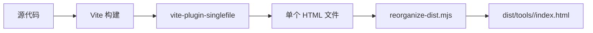

# 小工具开发指南

本文档将指导你如何在此项目中开发新的小工具。

---

## 📚 目录

1. [快速开始](#快速开始)
2. [项目架构](#项目架构)
3. [开发新工具](#开发新工具)
4. [UI 组件使用](#ui-组件使用)
5. [图标与样式](#图标与样式)
6. [构建与部署](#构建与部署)
7. [最佳实践](#最佳实践)

---

## 🚀 快速开始

### 环境要求

- **Node.js**: >= 18.0.0
- **npm**: >= 9.0.0

### 安装依赖

```bash
npm install
```

### 启动开发服务器

```bash
npm run dev
```

访问 http://localhost:5173 查看导航页，访问各个工具 HTML 查看具体工具。

---

## 🏗️ 项目架构

### 技术栈

| 技术 | 版本 | 用途 |
|------|------|------|
| **Vue 3** | 3.5.24 | 前端框架 |
| **Vite** | 7.2.6 | 构建工具 |
| **TypeScript** | 5.9.3 | 类型支持 |
| **Tailwind CSS** | 4.1.17 | 样式框架 |
| **shadcn-vue** | 2.4.0 | UI 组件库 |
| **vue-sonner** | 1.3.2 | Toast 通知 |
| **vite-plugin-singlefile** | 2.0.2 | 单文件打包 |

### 目录结构

```
src/
├── components/ui/          # shadcn-vue UI 组件
│   ├── button/            # 按钮组件
│   ├── card/              # 卡片容器
│   ├── label/             # 表单标签
│   ├── textarea/          # 多行文本框
│   ├── separator/         # 分隔线
│   └── sonner/            # Toast 通知
├── tools/                 # 所有工具实现
│   ├── base64-encoder/    # Base64 编码器
│   │   ├── main.ts       # 入口文件
│   │   ├── Base64EncoderApp.vue  # 主组件
│   │   └── assets/       # 工具专属资源
│   │       ├── icon.svg  # 页面图标（会被内联为 data URL）
│   │       └── favicon.svg  # 浏览器图标（已弃用，现用内联）
│   ├── json-formatter/
│   └── uuid-generator/
├── App.vue                # 导航页主组件
├── main.ts               # 导航页入口
└── style.css             # 全局样式

public/
├── tool-base64-encoder.html   # Base64 工具入口 HTML
├── tool-json-formatter.html   # JSON 工具入口 HTML
└── tool-uuid-generator.html   # UUID 工具入口 HTML

scripts/
└── reorganize-dist.mjs   # 构建后清理脚本

vite.config.tools.ts      # 工具构建配置
vite.config.index.ts      # 导航页构建配置
```

### 构建流程



每个工具独立构建，生成的 HTML 文件包含所有 JS、CSS 和图标资源，可独立部署。

---

## 🛠️ 开发新工具

### 步骤 1: 创建工具目录

在 `src/tools/` 下创建新目录：

```bash
mkdir -p src/tools/your-tool-name/assets
```

### 步骤 2: 创建主组件

**`src/tools/your-tool-name/YourToolApp.vue`**

```vue
<script setup lang="ts">
import { ref } from 'vue'
import { Button } from '@/components/ui/button'
import { Card } from '@/components/ui/card'
import { Label } from '@/components/ui/label'
import { Textarea } from '@/components/ui/textarea'
import { Separator } from '@/components/ui/separator'
import { Toaster } from '@/components/ui/sonner'
import { toast } from 'vue-sonner'
import IconTool from './assets/icon.svg?url' // 页面图标

// 工具状态
const input = ref('')
const output = ref('')

// 核心功能
function processInput() {
  try {
    // 你的处理逻辑
    output.value = input.value.toUpperCase() // 示例
    toast.success('处理成功', { description: '已完成转换' })
  } catch (error) {
    toast.error('处理失败', { 
      description: error instanceof Error ? error.message : '未知错误' 
    })
  }
}

// 复制结果
function copyResult() {
  if (!output.value) {
    toast.warning('没有可复制的内容')
    return
  }
  navigator.clipboard.writeText(output.value)
  toast.success('已复制到剪贴板')
}
</script>

<template>
  <div class="min-h-screen bg-background text-foreground">
    <Toaster />
    
    <main class="mx-auto flex max-w-3xl flex-col gap-6 px-4 py-8">
      <!-- 页眉 -->
      <header class="flex items-center justify-between gap-2">
        <div class="flex items-center gap-3">
          
          <div>
            <h1 class="text-2xl font-semibold tracking-tight">工具名称</h1>
            <p class="mt-1 text-xs text-muted-foreground">
              工具描述信息
            </p>
          </div>
        </div>
      </header>

      <Separator />

      <!-- 主要内容 -->
      <Card class="flex flex-col gap-4 p-4">
        <!-- 输入区 -->
        <div class="flex flex-col gap-2">
          <Label for="input">输入</Label>
          <Textarea
            id="input"
            v-model="input"
            rows="6"
            placeholder="在此输入..."
          />
        </div>

        <!-- 操作按钮 -->
        <div class="flex flex-wrap gap-2">
          <Button size="sm" @click="processInput">处理</Button>
          <Button size="sm" variant="outline" @click="input = ''">清空</Button>
        </div>

        <Separator />

        <!-- 输出区 -->
        <div class="flex flex-col gap-2">
          <div class="flex items-center justify-between">
            <Label for="output">输出</Label>
            <Button size="icon-sm" variant="ghost" @click="copyResult">
              复制
            </Button>
          </div>
          <Textarea
            id="output"
            v-model="output"
            rows="6"
            placeholder="这里会显示处理结果"
            readonly
          />
        </div>
      </Card>
    </main>
  </div>
</template>
```

### 步骤 3: 创建入口文件

**`src/tools/your-tool-name/main.ts`**

```typescript
import { createApp } from 'vue'
import App from './YourToolApp.vue'
import '@/style.css'

createApp(App).mount('#app')
```

### 步骤 4: 创建 HTML 入口

**`public/tool-your-tool-name.html`**

```html
<!doctype html>
<html lang="zh-CN">
  <head>
    <meta charset="UTF-8" />
    <!-- 内联 favicon（SVG Data URL） -->
    <link rel="icon" type="image/svg+xml" href="data:image/svg+xml,%3Csvg xmlns='http://www.w3.org/2000/svg' width='32' height='32' viewBox='0 0 32 32'%3E%3Crect width='32' height='32' rx='6' fill='%23f59e0b'/%3E%3Ctext x='16' y='22' font-size='16' font-weight='bold' text-anchor='middle' fill='white'%3E?%3C/text%3E%3C/svg%3E" />
    <title>工具名称 - Funny Toolbox</title>
    <meta name="viewport" content="width=device-width, initial-scale=1.0" />
  </head>
  <body class="min-h-screen bg-background text-foreground">
    <div id="app"></div>
    <script type="module" src="/src/tools/your-tool-name/main.ts"></script>
  </body>
</html>
```

### 步骤 5: 添加构建脚本

在 `package.json` 中添加：

```json
{
  "scripts": {
    "build:tool:yourtool": "cross-env TOOL_NAME=your-tool-name vite build --config vite.config.tools.ts",
    "build:tools": "npm run build:tool:base64 && npm run build:tool:json && npm run build:tool:uuid && npm run build:tool:yourtool && npm run build:index && node scripts/reorganize-dist.mjs"
  }
}
```

### 步骤 6: 更新导航页

在 `src/App.vue` 中添加工具链接：

```typescript
const tools = [
  // ... 现有工具
  {
    id: 'your-tool-name',
    name: '工具名称',
    description: '工具描述',
    href: '/tools/your-tool-name/'
  }
]
```

### 步骤 7: 构建测试

```bash
# 开发测试
npm run dev

# 构建单个工具
npm run build:tool:yourtool

# 构建所有工具
npm run build:tools
```

---

## 🎨 UI 组件使用

### 可用组件

项目已集成 **shadcn-vue** 组件库，以下是常用组件：

#### 1. Button（按钮）

```vue
<script setup lang="ts">
import { Button } from '@/components/ui/button'
</script>

<template>
  <!-- 默认按钮 -->
  <Button @click="handleClick">点击</Button>
  
  <!-- 不同尺寸 -->
  <Button size="sm">小按钮</Button>
  <Button size="default">默认</Button>
  <Button size="lg">大按钮</Button>
  
  <!-- 不同样式 -->
  <Button variant="default">主要</Button>
  <Button variant="outline">边框</Button>
  <Button variant="ghost">幽灵</Button>
  <Button variant="destructive">危险</Button>
  
  <!-- 图标按钮 -->
  <Button size="icon">🔍</Button>
</template>
```

#### 2. Card（卡片）

```vue
<script setup lang="ts">
import { Card } from '@/components/ui/card'
</script>

<template>
  <Card class="p-4">
    <!-- 卡片内容 -->
  </Card>
</template>
```

#### 3. Textarea（文本域）

```vue
<script setup lang="ts">
import { Textarea } from '@/components/ui/textarea'
import { ref } from 'vue'

const text = ref('')
</script>

<template>
  <Textarea
    v-model="text"
    rows="6"
    placeholder="输入文本..."
  />
</template>
```

#### 4. Label（标签）

```vue
<script setup lang="ts">
import { Label } from '@/components/ui/label'
</script>

<template>
  <Label for="input-id">标签文本</Label>
</template>
```

#### 5. Separator（分隔线）

```vue
<script setup lang="ts">
import { Separator } from '@/components/ui/separator'
</script>

<template>
  <Separator />
</template>
```

#### 6. Toast 通知（Sonner）

```vue
<script setup lang="ts">
import { Toaster } from '@/components/ui/sonner'
import { toast } from 'vue-sonner'

function showToast() {
  // 成功提示
  toast.success('操作成功', { description: '详细信息' })
  
  // 错误提示
  toast.error('操作失败', { description: '错误详情' })
  
  // 警告提示
  toast.warning('注意', { description: '警告信息' })
  
  // 普通提示
  toast.info('提示', { description: '信息内容' })
  
  // 加载中
  toast.loading('处理中...')
}
</script>

<template>
  <div>
    <!-- 在根组件中添加 Toaster -->
    <Toaster />
    
    <Button @click="showToast">显示通知</Button>
  </div>
</template>
```

**Toast 配置说明：**
- 默认位置：右下角（`bottom-right`）
- 自动关闭：默认 4 秒
- 无关闭按钮（已配置）
- 富文本颜色支持

---

## 🎭 图标与样式

### 页面图标（Page Icon）

页面图标显示在工具标题旁边，使用 SVG 格式。

**创建图标：**`src/tools/your-tool/assets/icon.svg`

```svg
<svg xmlns="http://www.w3.org/2000/svg" width="48" height="48" viewBox="0 0 24 24" fill="none" stroke="currentColor" stroke-width="2">
  <!-- 你的 SVG 路径 -->
  <circle cx="12" cy="12" r="10"/>
</svg>
```

**在组件中使用：**

```vue
<script setup lang="ts">
import IconTool from './assets/icon.svg?url'
</script>

<template>
  
</template>
```

**Vite 处理：**
- `?url` 后缀告诉 Vite 将 SVG 作为 URL 资源处理
- 构建时 `vite-plugin-singlefile` 自动将其转换为 **Base64 Data URL**
- 完全内联到 HTML 中，无需额外文件

### 浏览器图标（Favicon）

Favicon 显示在浏览器标签页，**必须使用内联 Data URL**。

**生成步骤：**

1. **创建 SVG 图标**（32x32 推荐）

```svg
<svg xmlns='http://www.w3.org/2000/svg' width='32' height='32' viewBox='0 0 32 32'>
  <rect width='32' height='32' rx='6' fill='#3b82f6'/>
  <text x='16' y='22' font-size='14' font-weight='bold' text-anchor='middle' fill='white'>AB</text>
</svg>
```

2. **URL 编码 SVG**（在线工具或代码）

```javascript
// 简单替换关键字符
const svgString = `<svg xmlns='http://www.w3.org/2000/svg'...></svg>`
const encoded = svgString
  .replace(/</g, '%3C')
  .replace(/>/g, '%3E')
  .replace(/#/g, '%23')
  .replace(/"/g, "'")
```

3. **添加到 HTML**

```html
<link rel="icon" type="image/svg+xml" href="data:image/svg+xml,%3Csvg xmlns='http://www.w3.org/2000/svg' width='32' height='32'...%3E%3C/svg%3E" />
```

**推荐的 Favicon 颜色：**

| 工具类型 | 推荐颜色 | 色值 |
|---------|---------|------|
| 编码/解码 | 蓝色 | `#3b82f6` |
| 格式化 | 绿色 | `#10b981` |
| 生成器 | 紫色 | `#8b5cf6` |
| 转换工具 | 橙色 | `#f59e0b` |
| 计算工具 | 红色 | `#ef4444` |

### Tailwind CSS 常用类

```vue
<template>
  <!-- 布局 -->
  <div class="flex flex-col gap-4">          <!-- 垂直布局，间距 1rem -->
  <div class="grid grid-cols-2 gap-2">      <!-- 网格布局 -->
  
  <!-- 尺寸 -->
  <div class="w-full h-full">               <!-- 宽高 100% -->
  <div class="max-w-3xl mx-auto">           <!-- 最大宽度 + 居中 -->
  <div class="size-10">                      <!-- 宽高 2.5rem -->
  
  <!-- 间距 -->
  <div class="p-4">                          <!-- padding: 1rem -->
  <div class="px-4 py-2">                    <!-- padding 水平/垂直 -->
  <div class="gap-2">                        <!-- flex/grid 间距 -->
  
  <!-- 文字 -->
  <h1 class="text-2xl font-semibold">       <!-- 字号 + 字重 -->
  <p class="text-muted-foreground">         <!-- 次要文字颜色 -->
  
  <!-- 圆角 -->
  <div class="rounded-md">                   <!-- border-radius -->
  <div class="rounded-lg">                   <!-- 更大圆角 -->
  
  <!-- 阴影 -->
  <div class="shadow-sm">                    <!-- 小阴影 -->
  <div class="shadow-md">                    <!-- 中阴影 -->
</template>
```

---

## 📦 构建与部署

### 本地开发

```bash
# 启动开发服务器
npm run dev

# 访问工具
# 导航页: http://localhost:5173/
# Base64: http://localhost:5173/tool-base64-encoder.html
# JSON:   http://localhost:5173/tool-json-formatter.html
# UUID:   http://localhost:5173/tool-uuid-generator.html
```

### 构建命令

```bash
# 构建单个工具
npm run build:tool:base64
npm run build:tool:json
npm run build:tool:uuid

# 构建所有工具（推荐）
npm run build:tools
```

### 构建产物

```
dist/
├── index.html              # 导航页（~120KB）
├── vite.svg
└── tools/
    ├── base64-encoder/
    │   └── index.html      # ~160KB，包含所有资源
    ├── json-formatter/
    │   └── index.html      # ~160KB
    └── uuid-generator/
        └── index.html      # ~160KB
```

每个 `index.html` 文件：
- ✅ 包含所有 JavaScript 代码（内联）
- ✅ 包含所有 CSS 样式（内联）
- ✅ 包含所有 SVG 图标（Base64 Data URL）
- ✅ 包含 Favicon（SVG Data URL）
- ✅ 零外部依赖，可独立运行

### 部署方式

#### 方式 1: 单工具部署

```bash
# 只部署一个工具
cp dist/tools/base64-encoder/index.html /var/www/html/base64.html

# 访问
https://your-domain.com/base64.html
```

#### 方式 2: 完整部署

```bash
# 部署整个 dist 目录
rsync -avz dist/ user@server:/var/www/html/tools/

# 访问
https://your-domain.com/tools/                    # 导航页
https://your-domain.com/tools/tools/base64-encoder/  # 工具
```

#### 方式 3: CDN 部署

```bash
# 上传到 CDN
aws s3 sync dist/ s3://your-bucket/tools/ --acl public-read

# 或使用阿里云 OSS
ossutil cp -r dist/ oss://your-bucket/tools/
```

#### 方式 4: GitHub Pages

```bash
# 1. 构建
npm run build:tools

# 2. 推送到 gh-pages 分支
git add dist -f
git commit -m "Deploy"
git subtree push --prefix dist origin gh-pages

# 3. 启用 GitHub Pages
# Settings > Pages > Source: gh-pages branch
```

---

## ✅ 最佳实践

### 1. 代码组织

```vue
<script setup lang="ts">
// 1. 导入依赖（按类型分组）
import { ref, computed } from 'vue'
import { Button } from '@/components/ui/button'
import { toast } from 'vue-sonner'
import IconTool from './assets/icon.svg?url'

// 2. 类型定义
interface ProcessOptions {
  format?: string
  validate?: boolean
}

// 3. 状态管理
const input = ref('')
const output = ref('')
const loading = ref(false)

// 4. 计算属性
const hasContent = computed(() => input.value.length > 0)

// 5. 方法定义
function processInput() {
  // 实现逻辑
}

function copyResult() {
  // 复制逻辑
}
</script>
```

### 2. 错误处理

```typescript
function processInput() {
  try {
    loading.value = true
    
    // 输入验证
    if (!input.value.trim()) {
      toast.warning('请输入内容')
      return
    }
    
    // 处理逻辑
    const result = someComplexOperation(input.value)
    
    // 成功反馈
    output.value = result
    toast.success('处理成功')
    
  } catch (error) {
    // 错误处理
    console.error('Processing failed:', error)
    toast.error('处理失败', {
      description: error instanceof Error ? error.message : '未知错误'
    })
  } finally {
    loading.value = false
  }
}
```

### 3. 用户体验

```vue
<template>
  <div>
    <!-- 提供清晰的占位符 -->
    <Textarea 
      placeholder="粘贴或输入文本..." 
      :disabled="loading"
    />
    
    <!-- 禁用状态反馈 -->
    <Button :disabled="!hasContent || loading" @click="process">
      {{ loading ? '处理中...' : '处理' }}
    </Button>
    
    <!-- 快捷操作 -->
    <Button variant="ghost" @click="clearAll">清空</Button>
    <Button variant="outline" @click="copyResult">复制</Button>
  </div>
</template>
```

### 4. 性能优化

```typescript
// 使用 computed 缓存计算结果
const formattedOutput = computed(() => {
  if (!output.value) return ''
  return formatLargeData(output.value)
})

// 大数据处理使用 Web Worker（如需要）
const worker = new Worker(new URL('./worker.ts', import.meta.url))

// 防抖处理
import { useDebounceFn } from '@vueuse/core'
const debouncedProcess = useDebounceFn(processInput, 300)
```

### 5. 可访问性

```vue
<template>
  <!-- 语义化标签 -->
  <main>
    <header>
      <h1>工具名称</h1>
    </header>
    
    <!-- 表单标签关联 -->
    <Label for="input-field">输入</Label>
    <Textarea id="input-field" />
    
    <!-- 按钮明确文本 -->
    <Button aria-label="复制结果到剪贴板">复制</Button>
  </main>
</template>
```

### 6. 测试建议

```typescript
// 手动测试清单
// ✅ 空输入处理
// ✅ 超大数据处理（>1MB）
// ✅ 特殊字符处理（emoji, Unicode）
// ✅ 错误输入提示
// ✅ 复制功能测试
// ✅ 移动端适配
// ✅ 深色模式兼容
```

---

## 📖 参考资源

- [Vue 3 文档](https://vuejs.org/)
- [Vite 文档](https://vitejs.dev/)
- [shadcn-vue 文档](https://www.shadcn-vue.com/)
- [Tailwind CSS 文档](https://tailwindcss.com/)
- [vue-sonner 文档](https://vue-sonner.vercel.app/)

---

## 🤝 贡献指南

### 提交代码

1. Fork 项目
2. 创建功能分支：`git checkout -b feature/your-tool`
3. 提交代码：`git commit -m 'Add your tool'`
4. 推送分支：`git push origin feature/your-tool`
5. 提交 Pull Request

### 代码规范

- 使用 TypeScript
- 遵循 Vue 3 Composition API
- 使用 Tailwind CSS 类名
- 组件命名使用 PascalCase
- 文件命名使用 kebab-case

---

## ❓ 常见问题

### Q1: 如何修改主题颜色？

修改 `src/style.css` 中的 CSS 变量：

```css
:root {
  --primary: oklch(20.5% 0 0);    /* 主色 */
  --destructive: oklch(57.7% .245 27.325);  /* 危险色 */
}
```

### Q2: 如何支持深色模式？

项目已内置深色模式支持，通过 `.dark` 类切换。可在 `style.css` 中自定义深色主题变量。

### Q3: 如何添加更多 shadcn-vue 组件？

```bash
# 使用 shadcn-vue CLI
npx shadcn-vue@latest add [component-name]

# 例如：添加 dialog 组件
npx shadcn-vue@latest add dialog
```

### Q4: 构建后文件太大怎么办？

- 检查是否引入了不必要的依赖
- 使用按需导入
- 考虑是否需要某些大型库
- 当前单个工具 ~160KB（已包含所有资源）是正常大小

### Q5: 如何调试构建后的 HTML？

```bash
# 使用 vite preview
npm run build:tools
npx vite preview --outDir dist

# 或直接用浏览器打开
# 右键 dist/tools/xxx/index.html > 打开方式 > 浏览器
```

---

## 📝 更新日志

### 2025-12-05
- ✅ 完善开发文档
- ✅ 修复 favicon 路径问题，改用内联 Data URL
- ✅ 添加页面图标支持（自动内联为 Base64）
- ✅ 优化构建流程，使用 vite-plugin-singlefile

### 初始版本
- ✅ 项目基础架构
- ✅ 三个示例工具（Base64、JSON、UUID）
- ✅ shadcn-vue UI 集成
- ✅ 单文件打包支持

---

**祝你开发愉快！** 🎉

如有问题，请提交 Issue 或参考现有工具代码作为模板。
